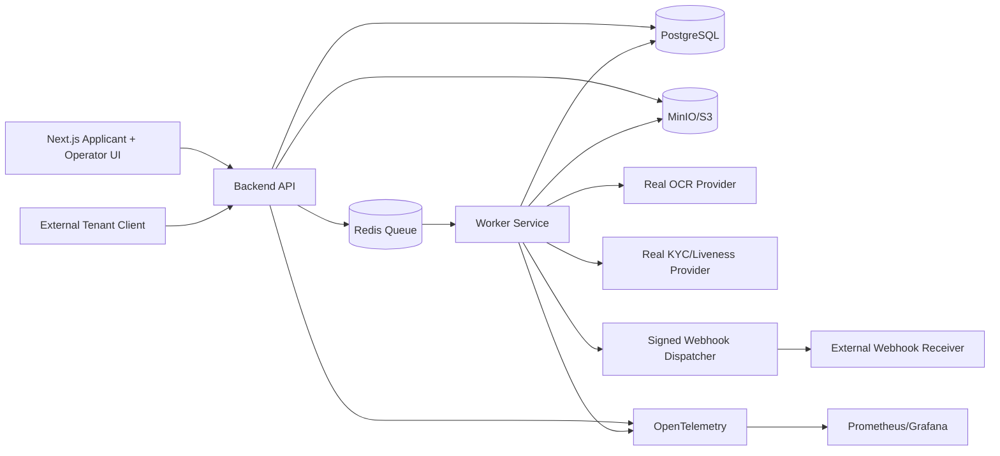

# TrustStack Lite Implementation Pack

**Project:** TrustStack Lite — risk-adaptive onboarding, consent governance, document verification, fraud/risk scoring, review operations, and webhook integration.

**Non-negotiable rule:** No fake success paths. Do not silently mock external systems. Do not add fallback providers that make tests pass without the configured real service. If a real external provider credential is missing, the relevant test must fail with a clear message saying exactly which environment variable is required.

**Local real infrastructure:** Docker Compose must run real PostgreSQL, Redis, MinIO/S3-compatible storage, backend API, worker, frontend, and observability services. Local MinIO is acceptable as real object storage for development; production must use AWS S3 or another real S3-compatible managed bucket.

**External verification:** Real OCR/redaction must use a configured OCR provider. Real KYC/PAN/Aadhaar/liveness checks must use a legally obtained provider sandbox/live account. Do not scrape government portals. Do not implement unauthorized Aadhaar/PAN verification.


## 00 — MASTER_IMPLEMENTATION.md

## 1. Why this project exists

TrustStack Lite is designed for the IDfy Software Engineer interview, not as a random portfolio app. The job description asks for end-to-end ownership, scalable cloud-native applications, APIs, microservices, UI, fraud counter-tech, strong testing, static analysis, load/performance testing, and product thinking. IDfy's own hiring file also describes OnboardIQ, OneRisk, and Privy as platform themes: onboarding, fraud/risk management, and privacy/data governance.

The point of this implementation pack is to build one coherent project that proves those signals in code.

## 2. What TrustStack Lite does

A B2B client creates an onboarding case for an applicant. The applicant accepts a versioned consent notice. The system stores the consent receipt, accepts identity document upload, runs OCR/redaction through a real provider, runs configured verification providers where credentials exist, computes explainable risk signals, emits signed webhooks, and routes risky cases to an analyst review dashboard.

## 3. Final system modules

| Module | Implementation MD | Output |
|---|---|---|
| Repo, Docker, CI skeleton | `01_REPO_INFRA_AND_DOCKER.md` | One-command local stack |
| Backend core and schema | `02_BACKEND_CORE_DB_SCHEMA.md` | FastAPI/Nest-style API with Postgres schema |
| Auth, tenancy, API keys, RBAC | `03_AUTH_TENANCY_API_KEYS_RBAC.md` | Secure tenant/operator auth |
| Consent/privacy ledger | `04_CONSENT_PRIVACY_LEDGER.md` | DPDP-style consent records and receipts |
| Document storage, OCR, redaction | `05_DOCUMENT_STORAGE_OCR_REDACTION.md` | Real OCR and redacted artifact pipeline |
| Verification provider adapters | `06_VERIFICATION_PROVIDER_ADAPTERS_REAL.md` | Live provider integration contract |
| Risk engine | `07_RISK_ENGINE_REASON_CODES.md` | Explainable risk scoring with reason codes |
| Async workers, events, webhooks | `08_ASYNC_WORKERS_EVENTS_WEBHOOKS.md` | Reliable async processing and signed callbacks |
| Frontend/operator dashboard | `09_REVIEW_DASHBOARD_FRONTEND.md` | Applicant flow + analyst queue |
| Audit, observability, security | `10_AUDIT_OBSERVABILITY_SECURITY.md` | Logs, traces, metrics, threat controls |
| Tests/load/quality gates | `11_TESTING_LOAD_CI_QUALITY_GATES.md` | CI that proves the system works |
| Deployment/cloud architecture | `12_DEPLOYMENT_CLOUD_K8S.md` | Production-grade deployment path |
| Demo/GitHub/interview | `13_DEMO_README_INTERVIEW.md` | README, demo script, screenshots, talking points |
| API keys/env checklist | `14_API_KEYS_ENV_CHECKLIST.md` | Complete credentials and env map |

## 4. Recommended stack

Use this stack unless you have a strong reason not to:

- **Frontend:** Next.js + TypeScript + TanStack Query.
- **Backend:** FastAPI + Python 3.12 OR NestJS + TypeScript. Pick one. Do not mix because you are already under interview time pressure.
- **Database:** PostgreSQL 16.
- **Queue:** Redis + RQ/Celery for Python, or Redis + BullMQ for Node.
- **Object storage:** MinIO locally, AWS S3 in cloud.
- **OCR:** Google Cloud Vision or AWS Textract. Use one real provider.
- **Image redaction:** server-side image processing using OCR bounding boxes, not fake text-only redaction.
- **Auth:** first-party JWT + Argon2 password hashing + tenant API keys.
- **Observability:** OpenTelemetry, Prometheus, Grafana, structured JSON logs.
- **CI:** GitHub Actions with test, type/lint, migration check, Docker build, Trivy scan.

For the fastest credible build, choose **FastAPI + PostgreSQL + Redis + MinIO + Next.js**.

## 5. Repository structure

```text
truststack-lite/
  apps/
    api/
      app/
      tests/
      alembic/
      pyproject.toml
      Dockerfile
    worker/
      app/
      tests/
      Dockerfile
    web/
      app/
      components/
      lib/
      tests/
      package.json
      Dockerfile
  packages/
    openapi/
    shared-contracts/
  infra/
    docker-compose.yml
    nginx/
    k8s/
    terraform/
  scripts/
    smoke-test.sh
    seed.sh
    load-test.sh
  docs/
    adr/
    architecture.md
    api.md
    testing.md
    security.md
    demo-script.md
  .github/workflows/ci.yml
  .env.example
  README.md
```

## 6. One-command requirement

The project must run locally with:

```bash
cp .env.example .env
docker compose up --build
```

After the stack starts:

- API health: `GET http://localhost:8000/health`
- Web app: `http://localhost:3000`
- OpenAPI: `http://localhost:8000/docs`
- MinIO console: `http://localhost:9001`
- Grafana: `http://localhost:3001`

If OCR/live verification env vars are missing, endpoints that need them must return `424 Failed Dependency`, not fake success.

## 7. System architecture



## 8. Global domain model

Core entities:

- `tenants`
- `tenant_api_keys`
- `users`
- `roles`
- `applicants`
- `onboarding_cases`
- `consent_notices`
- `consent_records`
- `documents`
- `verification_steps`
- `risk_signals`
- `risk_decisions`
- `review_tasks`
- `audit_events`
- `webhook_endpoints`
- `webhook_deliveries`
- `retention_requests`

## 9. Required project flows

### Flow A — happy path

1. Tenant creates applicant.
2. Tenant starts onboarding case.
3. Applicant accepts consent notice.
4. Applicant uploads identity document.
5. OCR extracts fields.
6. Redaction creates safe preview.
7. Risk engine computes low score.
8. System auto-approves.
9. Signed webhook is delivered.
10. Audit trail shows every state transition.

### Flow B — risky path

1. Tenant creates applicant.
2. Applicant uploads a reused document checksum or mismatched DOB document.
3. OCR extracts mismatch.
4. Risk engine creates reason codes.
5. Case enters manual review.
6. Analyst sees explanation and evidence.
7. Analyst approves/rejects with notes.
8. Webhook is delivered.
9. Audit trail captures override.

### Flow C — dependency missing path

1. OCR provider credential is missing.
2. Document verification request is submitted.
3. System does not pretend success.
4. API returns `424 Failed Dependency`.
5. Worker stores failure reason.
6. Dashboard shows blocked dependency.

## 10. Global test commands

Every MD must keep these commands passing unless the MD explicitly adds a new required env var:

```bash
docker compose up -d --build
docker compose exec api pytest -q
docker compose exec worker pytest -q
docker compose exec web npm test
docker compose exec web npm run lint
bash scripts/smoke-test.sh
bash scripts/load-test.sh
```

For real external provider tests:

```bash
RUN_EXTERNAL_TESTS=true docker compose exec worker pytest tests/external -q
```

If `RUN_EXTERNAL_TESTS=true` and required provider credentials are absent, tests must fail.

## 11. Definition of done for the full project

The full project is complete only when:

- One-command Docker stack runs.
- OpenAPI docs are generated.
- Real Postgres migrations are applied.
- Real Redis worker processes async jobs.
- Real object storage stores uploaded and redacted documents.
- Real OCR provider is used for OCR tests when configured.
- Missing external provider credentials fail loudly.
- Applicant flow works end to end.
- Analyst dashboard works end to end.
- Webhooks are signed, retried, and idempotent.
- Audit events exist for all sensitive operations.
- Tests include unit, integration, E2E, external-gated, and load tests.
- README includes architecture, setup, env vars, screenshots, demo script, and trade-offs.

## 12. Strict implementation order

Recommended order:

1. `01_REPO_INFRA_AND_DOCKER.md`
2. `02_BACKEND_CORE_DB_SCHEMA.md`
3. `03_AUTH_TENANCY_API_KEYS_RBAC.md`
4. `04_CONSENT_PRIVACY_LEDGER.md`
5. `05_DOCUMENT_STORAGE_OCR_REDACTION.md`
6. `06_VERIFICATION_PROVIDER_ADAPTERS_REAL.md`
7. `07_RISK_ENGINE_REASON_CODES.md`
8. `08_ASYNC_WORKERS_EVENTS_WEBHOOKS.md`
9. `09_REVIEW_DASHBOARD_FRONTEND.md`
10. `10_AUDIT_OBSERVABILITY_SECURITY.md`
11. `11_TESTING_LOAD_CI_QUALITY_GATES.md`
12. `12_DEPLOYMENT_CLOUD_K8S.md`
13. `13_DEMO_README_INTERVIEW.md`
14. `14_API_KEYS_ENV_CHECKLIST.md`

You can implement individual MDs independently, but each MD must respect the global domain model, env naming, error handling, and no-fake-success rule.
